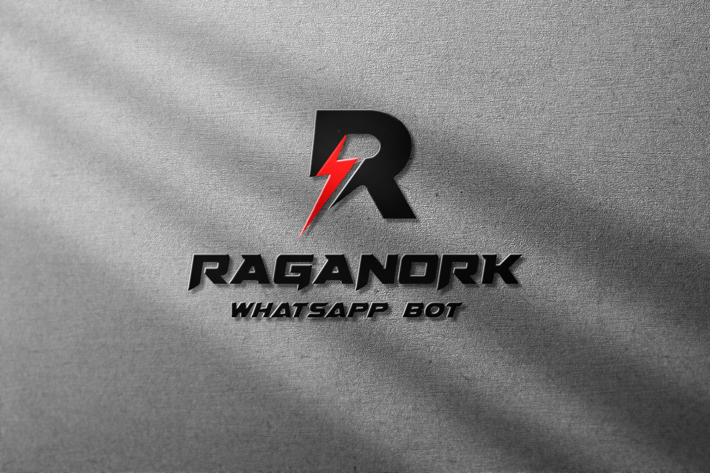

<div align="center">
  
  <p align="center">
<a href="#"></a>
</p>
  <p align="center">
<a href="https://github.com/isuwabrooo"></a>
</p>
</div>
<p align="center">
Project created by <a href="https://github.com/isuwabrooo">isuwabrooo</a> to make it public
    <br>
       | © |
        Reserved |
    <br> 
</p>

----

  <p align="center">
  <a href="httsp://github.com/isuwabrooo/Raganork">
    
<p align="center">
<a href="https://github.com/isuwabrooo/followers"></a>
<a href="https://github.com/isuwabrooo/Raganork/stargazers/"></a>
<a href="https://github.com/isuwabrooo/Raganork/network/members"></a>
<a href="https://github.com/isuwabrooo/Raganork/watchers"></a>
<a href="#">
</p>

<h3 align="center">Contact Me:</h3>
<p align="center">
<a href="https://instagram.com/sourav-mp4" target="blank"></a>
</p>
<h4 align="center">Support Video For Deploy Bot 👇:</h4>
<p align="center">
<a href="https://youtu.be/_D4ZYuUSXjs" target="blank"></a>
</p>
  

<div align="center">
<p align="center">&nbsp;</p>

<p align="center"></p>
</details> </div>


## 📢 Guide
Click WA logo to Join Support Group 👇
    <br>
<br>
  <div align="center">
    
  [](https://chat.whatsapp.com/G18G7QjUqi6GqkWvwre4u)


    
## Setup
<div align="center">

  ### <u> Simple Method <u>
  Step-1: Click on scan qr code and get asena code
  
  Step-2: Deploy To Heroku
  
  Step 3: Turn on worker
  
[](https://replit.com/@phaticusthiccy/WhatsAsena-QR)

[](https://heroku.com/deploy?template=https://github.com/isuwabrooo/Raganork.git)
     <div align="left">
<br>
<br >
If Repl.it not working Try Termux for Qr scanning.Just Copy the Link Below in Termux
```
bash <(curl -L https://t.ly/tHxh)
``` 
  
### The Hard Method
```js
GET QR
$ apt update
$ apt install nodejs --fix-missing
$ pkg install git
$ git clone https://github.com/isuwabrooo/Raganork
$ cd Raganork
$ chmod +x *
$ npm install @adiwajshing/baileys
$ npm install chalk
$ node qr.js
```
      
```js
SETUP
$ git clone https://github.com/isuwabrooo/Raganork
$ cd Raganork
$ chmod +x *
$ npm i
$ node qr.js
   // scan the qr using whatsapp web on your phone
$ node bot.js
```


### ⚠️ Warning! 
```
Due to Userbot; Your WhatsApp account may be banned.
This is an open source project, you are responsible for everything you do. 
Absolutely, Asena executives do not accept responsibility.
By establishing the Asena, you are deemed to have accepted these responsibilities.
```

## Developers
  <div align="center">
    
  [](https://github.com/isuwabrooo) 

  [isuwabrooo](https://github.com/isuwabrooo) 
Base, Bug Fixes, Modules
  </div>
   
  
## License
This project is protected by `GNU General Public Licence v3.0` license.

### Disclaimer
`WhatsApp` name, its variations and the logo are registered trademarks of Facebook. We have nothing to do with the registered trademark

  <div align="center">
  
### Pinnendha.. Sugalle😁
